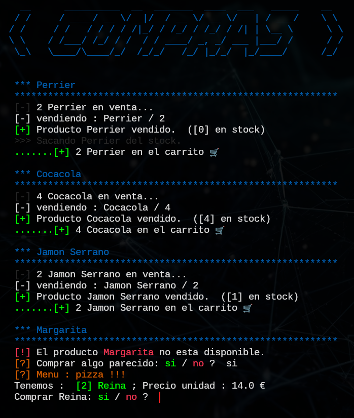

# Ejercicios de POO

Practicing some OOP concepts from the hack4u.io Offensive Python course.  
Personal exercises. 

Check [lista1.md](https://github.com/rnek0/pypapeando/blob/main/lista1.md) for more explanations. 

---


---

## Add main2.py

Update de las compras [aquí](main2.py) (version 2 de mis ejercicios)




## Add a .gitignore

```
wget https://raw.githubusercontent.com/github/gitignore/main/Python.gitignore
mv Python.gitignore .gitignore
```